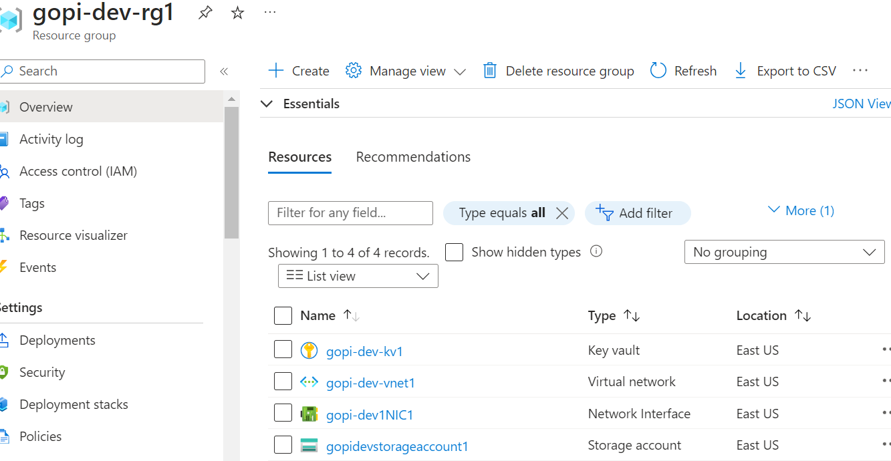

<h1>CI/CD Pipelines for Infrastructure Deployment with Terraform in Azure DevOps</h1>
<h3>Objective:</h3>
The aim is to establish Continuous Integration (CI) and Continuous Deployment (CD) pipelines using Azure DevOps Pipelines for deploying infrastructure across various environments (Development, Quality Assurance, Pre-production, and Production) using Terraform. The infrastructure comprises Virtual Machines (VMs), Key Vaults, Virtual Networks (Vnets), Subnets, Network Interfaces, and Storage Accounts.

<h2>FILES:</h2>

<h5>main.tf:</h5>
Describes the Azure resources (Resource Group, Virtual Network, Subnet, Network Interface, Virtual Machine, Key Vault, Storage Account) using Terraform.
<h5>variables.tf:</h5>
Defines parameters utilized in the Terraform configuration for personalizing resource names, locations, sizes, etc.
<h5>env.tf:</h5>
Illustrates the Terraform modules for deploying infrastructure across various environments.

<h5>azure-pipeline.yml:</h5>
Azure Pipelines YAML file for establishing CI/CD pipelines to deploy infrastructure modifications automatically.
<h3>TERRAFORM CONFIGURATION:</h3>
The Terraform configuration (env.tf, main.tf, variables.tf) delineates the infrastructure resources to be deployed across different environments. It encompasses modules for crafting Virtual Machines, Virtual Networks, Subnets, Network Interfaces, Key Vaults, and Storage Accounts. Customize the parameters in variables.tf as per your requisites.

<h3>CI/CD PIPELINE:</h3>
The pipeline.yml file comprises the Azure Pipelines YAML configuration for configuring CI/CD pipelines. It defines a pipeline trigger on the main branch and outlines stages for deploying infrastructure modifications to the Development, Quality Assurance, Pre-production, and Production environments using Terraform.

<h3>Getting Started:</h3>
To commence deploying the infrastructure using Terraform and Azure Pipelines:

Ensure accessibility to an Azure DevOps organization and have configured Azure service principals for authentication.
Update the parameters in variables.tf with the desired values for your environment.
Configure the Azure Pipelines YAML file (pipeline.yml) with the essential parameters for authentication and environment-specific settings.
Commit and push your modifications to the repository to initiate the CI/CD pipeline.
<h3>DEPENDENCIES:</h3>
Azure DevOps organization with permissions to create and manage pipelines.
Azure service principal with appropriate permissions for provisioning Azure resources.
Terraform installed on the build agent for executing Terraform commands.
FEEDBACK:
Feedback and contributions are appreciated! If you encounter any concerns or have suggestions for enhancements, kindly raise an issue or submit a pull request.

<h2>Results:</h2>
Revise the content with equivalent meaning without altering any technical terminology.
**<h2>Results:</h2>**

